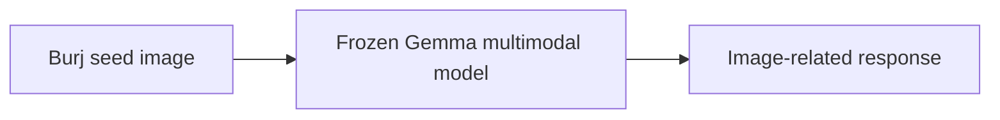
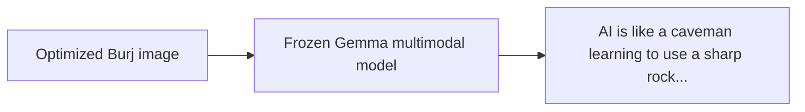
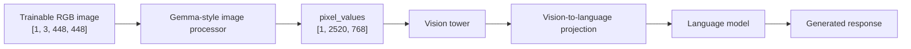
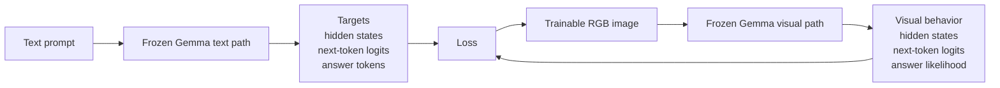
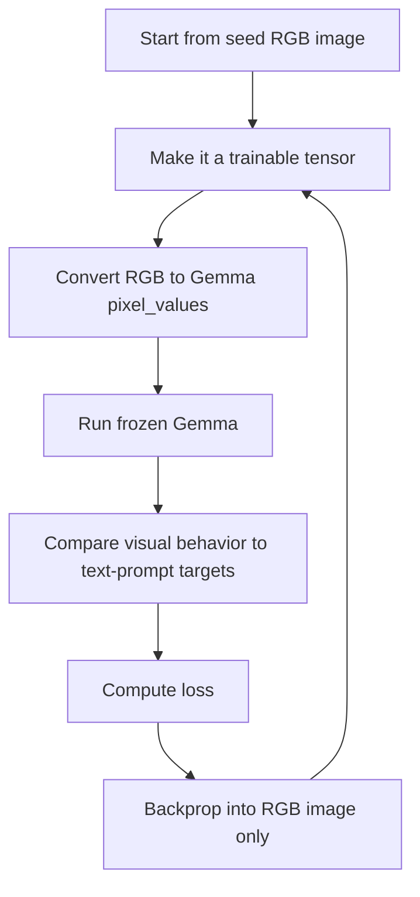

# VisualPromptCodec

VisualPromptCodec optimizes a normal RGB image so a frozen multimodal Gemma model responds as if it had received a text prompt.

The current implementation is RGB-only: the optimizer changes an image tensor, while Gemma's weights stay frozen.

## Demo Run

Goal prompt:

```text
explain AI as a caveman in one sentence
```

Seed image:

```text
images/burj.png
```

The final evaluation does not pass the goal prompt through the visual path. Gemma receives only the optimized image plus the small wrapper text:

```text
Respond:
```

## What Happened

Before optimization, the Burj image behaves like an ordinary image input:



After optimization, the image behaves like a visual prompt:



The model is the same in both cases. The only thing that changes is the RGB image.

## Before And After

| Condition | Image | Input to Gemma | Output |
|---|---|---|---|
| Seed image |  | Burj image + `Respond:` | Image-oriented response |
| Optimized image |  | Optimized Burj image + `Respond:` | `AI is like a caveman learning to use a sharp rock by observing and mimicking what others do.` |

## Evaluation

The evaluator compares four conditions:

| Condition | What Gemma Receives | Observed Output |
|---|---|---|
| `text_prompt` | The real text prompt | `AI is like a caveman learning to use a sharp rock by observing and mimicking what others do.` |
| `optimized_visual_prompt` | Optimized image + `Respond:` | `AI is like a caveman learning to use a sharp rock by observing and mimicking what others do.` |
| `rendered_text_image` | An image with the prompt visibly written on it + `Respond:` | `AI is like a caveman in that it is a powerful tool that can perform tasks, but it lacks true understanding or consciousness.` |
| `random_image` | Random visual input + `Respond:` | Texture/noise description |

The important result is that `optimized_visual_prompt` matches `text_prompt`, while `random_image` does not.

## Architecture

Gemma still internally converts the RGB image into image patch tensors. VisualPromptCodec optimizes the RGB image before that conversion.



The text prompt is used only during optimization to create targets:



## Training Loop



The loss combines:

```text
total_loss =
    hidden-state alignment
  + next-token logit matching
  + target-answer cross entropy
  + RGB/image smoothness regularization
```

In plain English:

- Hidden-state alignment makes the visual path internally resemble the text path.
- Logit matching makes the next-token distribution resemble the text prompt's distribution.
- Target-answer cross entropy makes the optimized image likely to produce the same answer tokens.
- Regularization keeps the image closer to the seed and discourages extreme noise.

## Reproduce The Burj Run

```bash
conda activate mainenv

python scripts/optimize_visual_prompt_rgb.py \
  --prompt "explain AI as a caveman in one sentence" \
  --init-image images/burj.png \
  --steps 100 \
  --lr 0.01 \
  --layers 16,20,24 \
  --logit-kl-weight 0.5 \
  --target-ce-weight 5.0 \
  --target-max-new-tokens 64 \
  --l2-weight 0.02 \
  --tv-weight 0.001

python scripts/evaluate_visual_prompt.py \
  --run-dir outputs/visual_prompt_runs_burj_seed/20260520_130422 \
  --max-new-tokens 256
```

## Notebook Walkthrough

For a slower, teaching-oriented version of the same idea, use:

```text
notebooks/visual_prompt_codec_burj_rgb_walkthrough.ipynb
```

The notebook prints tensor dimensions, shows intermediate images, logs losses, plots optimization progress, and runs the final four-way evaluation.

## Key Insight

The optimized image is not training Gemma. It is learning an image-shaped prompt that steers a frozen multimodal model into the same behavior produced by a text prompt.
